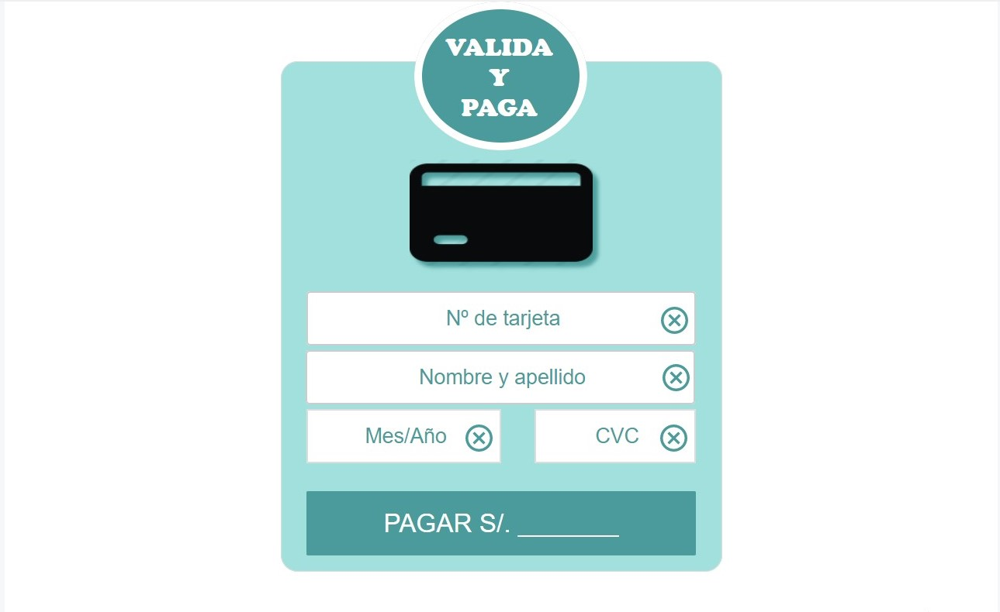
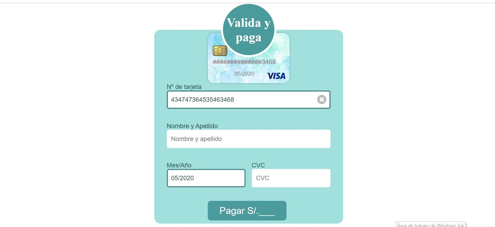
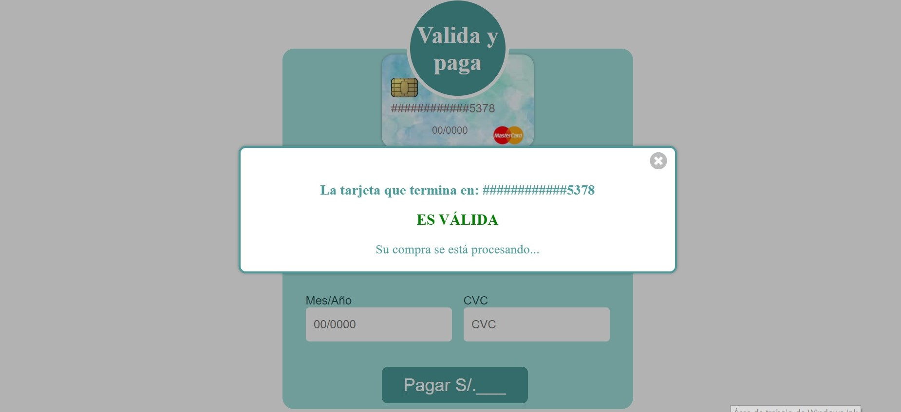
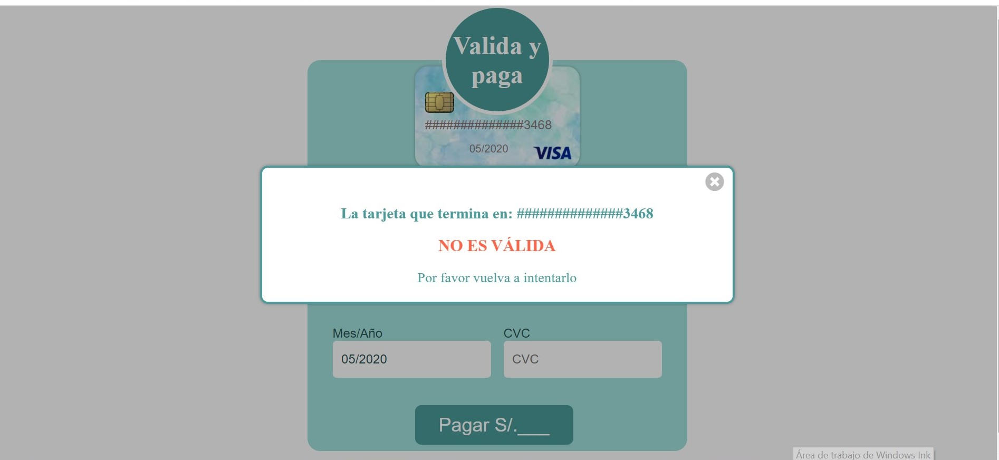

# Valida-y-paga.com 
(Validación de tarjeta de crédito o débito antes de procesar un pago)

***
## 1. Definición del producto

Este aplicativo web 'validación de tarjeta', puede usarse en una pasarela de pagos, pues allí se necesita realizar una validación de la tarjeta ingresada antes de procesar el pago.
## 2. Resumen del proyecto

Este proyecto consiste en construir una aplicación web que permite validar una tarjeta de crédito o débito según el algoritmo de luhn, enmascara el número de tarjeta mostrando sólo los últimos 4 dígitos para proteger la privacidad del usuario e identifica la empresa a la que pertenece la tarjeta.

## 3. Investigación UX
### Usuarios y objetivos en relación con el producto

Los principales usuarios del producto son personas que compran en línea y utilizan como medio de pago las tarjetas de crédito o débito.

Los objetivos de estos usuarios es saber si ingresaron correctamente los números de la tarjeta, pues de lo contrario no se procesará el pago.

### Solución de los problemas/necesidades de los usuarios

Esta solución ayuda al usuario a darse cuenta si cometieron un error al ingresar los números de tarjeta antes de procesar un pago, para evitar el rechazo por parte de la entidad bancaria.

### Prototipo de baja fidelidad

Mi primer prototipo en papel

### Prototipo final

***
## 4. Plan de acción para cumplir con los Objetivos de Aprendizaje

### Objetivos de aprendizaje para profundizar después del proyecto Trivia
#### HTML y CSS

* [ ] Uso de HTML semántico.
* [ ] Identificar el uso de selectores de CSS.

#### DOM

* [ ] Entender y reconocer los selectores del DOM.
* [ ] Manejo de eventos del DOM.
* [ ] Manipulación dinámica del DOM.

#### JavaScript

* [ ] Manipulación de strings.
* [ ] Profundizar el uso de condicionales (if-else | switch | operador ternario)
* [ ] Profundizar el uso de bucles (for | for..in | for..of | while)
* [ ] Profundizar el uso de funciones (parámetros | argumentos | valor de retorno)

### Objetivos de aprendizaje nuevos en Card Validation

#### HTML Y CSS

* [ ] Maquetación del diseño.

#### Testing

* [ ] Testeo unitario.

#### Estructura del código y guía de estilo

* [ ] Organizar y dividir el código en módulos (Modularización)
* [ ] Uso de identificadores descriptivos (Nomenclatura | Semántica)
* [ ] Uso de linter (ESLINT)

#### Git y GitHub

* [ ] Uso de comandos de git (add | commit | pull | status | push)
* [ ] Manejo de repositorios de GitHub (clone | fork | gh-pages)

#### UX

* [ ] Diseñar la aplicación pensando y entendiendo al usuario.
* [ ] Crear prototipos para obtener feedback e iterar.
* [ ] Aplicar los principios de diseño visual (contraste, alineación, jerarquía)

### Acciones en específico que realicé para cumplir con los OA

* [ ] Investigar y aprender por las noches y fines de semana sobre nuevas funcionalidades en Javascript, HTML y CSS.
* [ ] Llevar cursos básicos en Javascript y HTML
* [ ] Preguntar a los coachs y a mis compañeras cada vez que me surgían dudas.
* [ ] Organizar mis tareas en Trello según los Objetivos de Aprendizaje que faltaban profundizar.

#### Meta: profundización de los OA
#### Plazo: fin del primer proyecto

## 5. Interfaz del proyecto final

